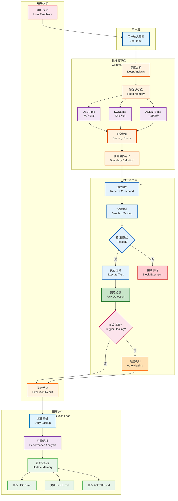

# OpenClaw Alignment System

> Reinforcement-learning driven workflow alignment engine (Actor-Critic)

**English** | **[简体中文](README.zh-CN.md)**

## Features

- Actor-Critic RL core pipeline
- Four-dimensional reward system (objective/behavior/explicit/pattern)
- Optional Phase3 modules (distributed training, tuning, monitoring, performance)
- Contract drift guards (state/action dimensions + docs consistency)
- Cross-platform support: Windows / macOS / Linux

## Support Matrix

- Python: 3.10, 3.11, 3.12, 3.13
- OS: Windows, macOS, Linux

## Demo

### Quick Start Demo


> Watch how easy it is to get started with OpenClaw Alignment!

### Disaster Recovery Demo


> **场景对比**：未受保护的 Agent 失控（🔴）vs OpenClaw Alignment 阻断（🟢）

The disaster recovery demo showcases:

- **Scene A (Red)**: Unprotected agent receiving vague instruction "clean-workspace --aggressive" and executing dangerous `rm -rf` commands
- **Scene B (Green)**: OpenClaw Alignment Commander intercepting the same instruction by:
  - Reading SOUL.md boundary rules
  - Detecting high-risk intent
  - Triggering fail-closed safety mechanism
  - Requesting user confirmation

## Installation

### 1) PyPI (Recommended)

```bash
pip install openclaw-alignment
```

Optional Phase3 extras:

```bash
pip install "openclaw-alignment[phase3]"
```

### 2) Install from source

```bash
git clone https://github.com/412984588/openclaw-alignment.git
cd openclaw-alignment
python3 scripts/install.py
```

Development install:

```bash
python3 scripts/install.py --dev --editable
```

## Quick Start

Get started with OpenClaw Alignment in three simple steps:

### Step 1: Install

```bash
pip install openclaw-alignment
```

### Step 2: Initialize

```bash
# Initialize in current directory
openclaw-align init

# Or initialize in a specific directory
openclaw-align init ~/projects/my-project
```

This creates a `.openclaw_memory` folder with three configuration files:

- **USER.md** - Your personal preferences (tech stack, coding style, work habits)
- **SOUL.md** - System constitution (principles, boundaries, ethics)
- **AGENTS.md** - Tool dispatch configuration (available AI agents and strategies)

### Step 3: Customize

Edit the generated files to match your needs:

```bash
# Edit your personal profile
vim .openclaw_memory/USER.md

# Review system principles
vim .openclaw_memory/SOUL.md

# Check available agents
vim .openclaw_memory/AGENTS.md
```

### Step 4: Analyze (Optional)

Let the system learn from your Git history:

```bash
openclaw-align analyze
```

### What's Next?

After initialization, the system will:

✅ Learn your coding preferences from Git history
✅ Recommend the best AI agent for each task
✅ Adapt to your workflow automatically
✅ Respect the boundaries defined in SOUL.md

### Status Check

```bash
openclaw-align status
```

## Quick Verification

```bash
python3 -m pytest tests/ -v
python3 scripts/check_docs_consistency.py
openclaw-alignment --help
```

## Architecture

### System Flow



### Core (Phase 1-2)

- `lib/reward.py`: reward calculation engine
- `lib/environment.py`: interaction environment
  - `State`: State data class (17 dimensions)
  - `Action`: Action data class (11 dimensions)
- `lib/agent.py`: Actor-Critic agent
- `lib/learner.py`: online learner
- `lib/trainer.py`: training loop
- `lib/contracts.py`: single source of truth for dimensions

### Optional (Phase 3)

- `lib/distributed_trainer.py`
- `lib/hyperparameter_tuner.py`
- `lib/monitoring.py`
- `lib/performance_optimizer.py`

## Documentation

- Architecture: `docs/architecture.md`
- Reward model: `docs/reward-model.md`
- Configuration: `docs/configuration.md`
- Optional dependencies: `docs/phase3-optional-deps.md`
- Contributing: `CONTRIBUTING.md`
- Security: `SECURITY.md`
- Support: `SUPPORT.md`

## Test Coverage

- **Total Tests**: 80
- **Pass Rate**: 100%
- **Core RL + integration**: 54 tests ✅
- **Phase 2**: 1 test ✅
- **Phase 3**: 21 tests ✅
- **Docs/contract drift guards**: 4 tests ✅

## Release and Versioning

- Versioning: SemVer (stable branch: `release/1.0.x`)
- Release runbook: `RELEASING.md` / `RELEASING.zh-CN.md`
- Changelog: `CHANGELOG.md`

## License

MIT
